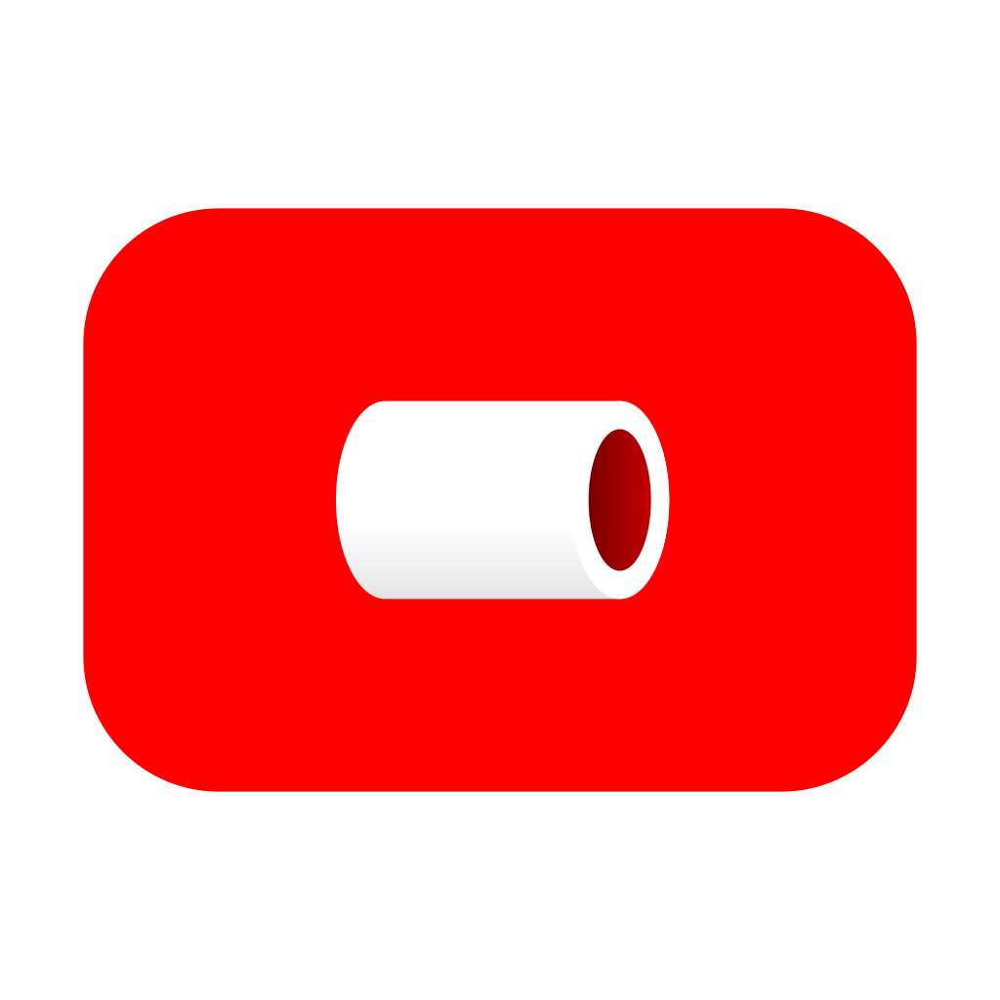
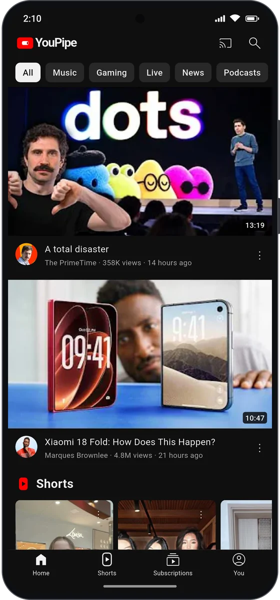
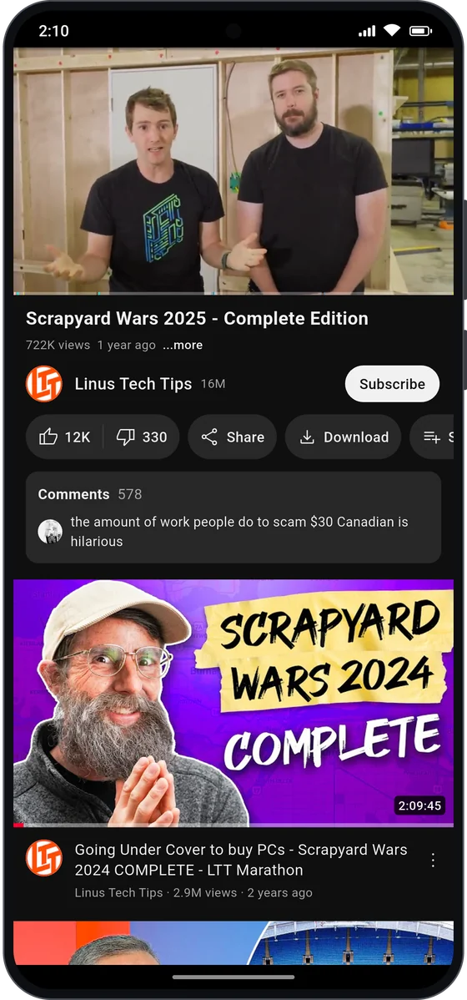
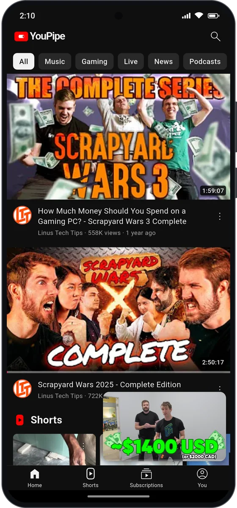
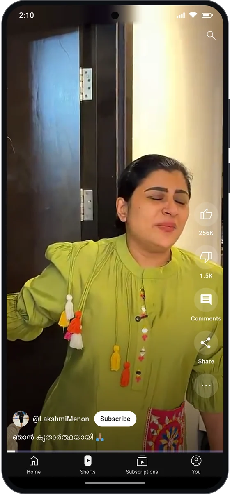
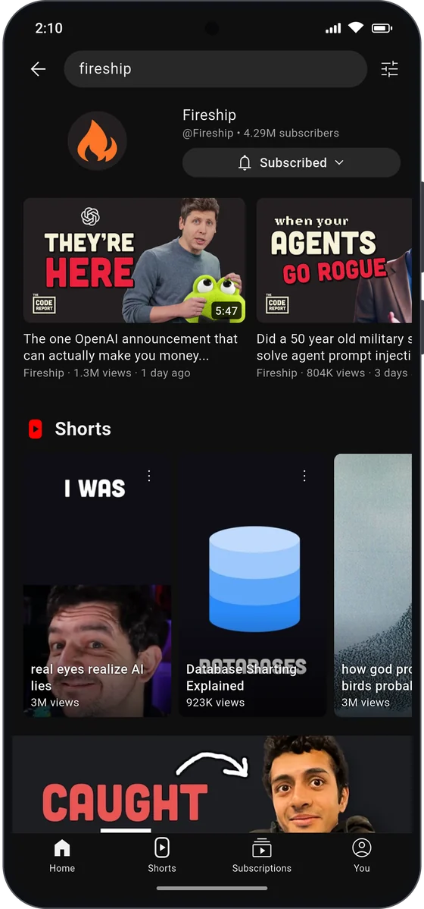
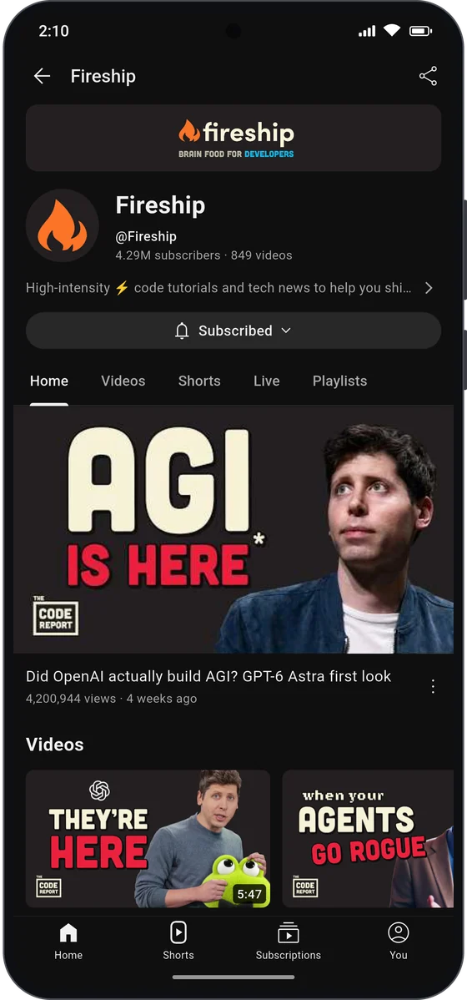
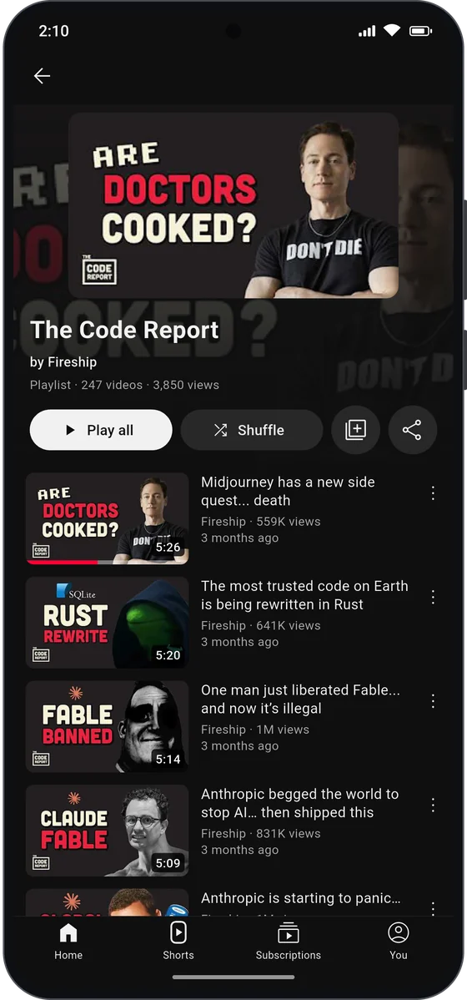
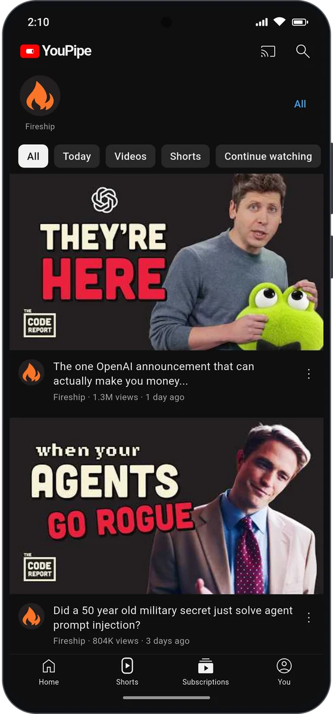

<div align="center">



# YouPipe

**All of YouTube, none of the ads.**<br/>
A free, ad-free YouTube client for Android, with background play, picture-in-picture, downloads and SponsorBlock.

[](https://github.com/SanuSanal/YouPipe/releases/latest)
[](https://github.com/SanuSanal/YouPipe/releases)
[](#-download)
[](https://flutter.dev)

<a href="https://github.com/SanuSanal/YouPipe/releases/latest">
  
</a>
<a href="https://sanusanal.github.io/YouPipe/">
  
</a>

</div>

---

## 📸 Screenshots

<table align="center">
  <tr>
    <td align="center"><br/><sub><b>Home</b></sub></td>
    <td align="center"><br/><sub><b>Watch</b></sub></td>
    <td align="center"><br/><sub><b>Mini player</b></sub></td>
    <td align="center"><br/><sub><b>Shorts</b></sub></td>
  </tr>
  <tr>
    <td align="center"><br/><sub><b>Search</b></sub></td>
    <td align="center"><br/><sub><b>Channels</b></sub></td>
    <td align="center"><br/><sub><b>Playlists</b></sub></td>
    <td align="center"><br/><sub><b>Subscriptions</b></sub></td>
  </tr>
</table>

---

## ✨ Features

**Watch**
- Everything from YouTube: videos, Shorts, channels, playlists, comments and search with filters
- **No ads**, ever
- Background play with notification and lock-screen controls
- **Picture-in-picture** when you leave the app, and a floating mini player while you browse (swipe it up to open, down to close)
- Up to 4K, with chapters, captions and seek-bar previews

**Skip the boring bits**
- Skip sponsor segments, intros and reminders automatically (via [SponsorBlock](https://sponsor.ajay.app); off by default, turn it on in Settings)
- Dislike counts are back (via [Return YouTube Dislike](https://returnyoutubedislike.com))
- Double-tap to seek, hold for 2× speed, playback speed, loop and sleep timer

**Look & feel**
- A familiar interface modelled on the YouTube Android app, so there's nothing new to learn
- Dark and light themes

**Offline & library**
- Download videos up to 1080p to watch offline
- Subscribe to channels **without an account**; new uploads come from each channel's public feed
- Import subscriptions from Google Takeout or NewPipe
- History, playlists, liked videos and Watch later on the device. Even Home is put together on your phone from what you watch
- **Optional** sign-in to bring in your YouTube library, likes and recommendations

**Cast**
- Cast to smart TVs (DLNA) or a Chromecast / Google TV

**Phones, tablets and TVs**
- Tablets get YouTube's tablet layout: rotation, a grid of videos, a side rail, and the video next to related videos
- Runs on **Android TV, Google TV and Fire TV** with the remote: it shows up on the TV home screen, the focus is always visible, and videos open fullscreen

---

## 📥 Download

Grab the latest APK from the **[Releases page](https://github.com/SanuSanal/YouPipe/releases/latest)** and install it. After that, the app tells you when there's a new version and installs it for you.

The same app runs on phones, tablets and TVs; pick the APK for the device's processor:

| APK | For |
|---|---|
| `arm64-v8a` | Phones, tablets and most Android/Google TVs |
| `armeabi-v7a` | Older 32-bit phones and Fire TV sticks |
| `x86_64` | Emulators and Chromebooks |

> [!NOTE]
> YouPipe isn't on the Play Store. Android may ask you to allow installs from your browser or file manager the first time.
>
> **On a TV:** sideload the APK with a file manager or the Downloader app (on Fire TV, allow apps from unknown sources for it). YouPipe then appears on the TV's home screen.

---

## 🔒 Privacy

- No ads, no trackers, no analytics.
- Your subscriptions, history, playlists and downloads stay on your device.
- Signing in is optional. You sign in on Google's own page, and YouPipe never sees your password.

---

## ❤️ Support the project

YouPipe is free and always will be. If it made your day a little better, you can buy me a coffee. Every bit helps keep the app alive and updated.

<p align="center">
  <a href="https://www.buymeacoffee.com/sanalm555k">
    
  </a>
  &nbsp;
  <a href="https://www.paypal.com/donate/?hosted_button_id=HBGNBZL5VRMTY">
    
  </a>
  &nbsp;
  <a href="https://revolut.me/sanalmyfyj">
    
  </a>
</p>

A ⭐ on this repo helps too! Looking for music? Try **[YouPipe Music](https://github.com/SanuSanal/YouPipe-Music)**.

---

## 🙏 Credits

YouPipe stands on the shoulders of these great open-source projects:

- [NewPipeExtractor](https://github.com/TeamNewPipe/NewPipeExtractor): video streams, captions and previews
- [video_player](https://pub.dev/packages/video_player) (ExoPlayer) and [audio_service](https://pub.dev/packages/audio_service): playback
- [SponsorBlock](https://sponsor.ajay.app): skipping sponsor segments
- [Return YouTube Dislike](https://returnyoutubedislike.com): dislike counts
- [drift](https://pub.dev/packages/drift): the local library database

<details>
<summary><b>🛠️ For developers</b></summary>

<br/>

Browse, search, comments and account features go through a pure-Dart client for YouTube's internal InnerTube API (`lib/innertube/`, the `WEB` client). Streams, captions, storyboards and chapters are resolved on Android by NewPipeExtractor and played by ExoPlayer through `video_player`, behind `audio_service`. The library lives in SQLite via `drift`.

Architecture and design decisions are in [`docs/`](docs/README.md). Read [`AGENTS.md`](AGENTS.md) before contributing.

```
lib/innertube/   InnerTube client, models, parsers
lib/data/        video info, drift database, library, local Home, subscription feeds
lib/player/      video player service, cast, DLNA
lib/features/    screens and optional features (home, search, watch, shorts, channel, playlist, downloads, …)
lib/ui/          theme, router, shell (watch panel and mini player), shared widgets
test/            parser tests against recorded fixtures + live API smoke tests
```

```bash
flutter pub get
dart run build_runner build --delete-conflicting-outputs   # drift code
flutter test                                              # offline tests
flutter test --tags live --run-skipped                    # hits the real API
flutter run
```

If YouTube changes break browsing, re-record fixtures and refresh the client version in `lib/innertube/clients.dart` (or ship it through `config/remote.json`). If playback breaks, bump the NewPipeExtractor version in `android/app/build.gradle.kts` first.

</details>

---

## ⚖️ Disclaimer

1. YouPipe is an unofficial app. It is not affiliated with, endorsed by or connected to YouTube, Google LLC or any of their subsidiaries.
2. All trademarks, and all videos and content shown in the app, belong to their respective owners.
3. The app uses YouTube's private API, which is against YouTube's Terms of Service. It is meant for personal use and is distributed outside the Play Store.
4. Use it at your own risk. The developer isn't responsible for any misuse or for issues arising from its use.

<div align="center">
<br/>
<sub>Made with ♥ for people who just want to watch</sub>
</div>
